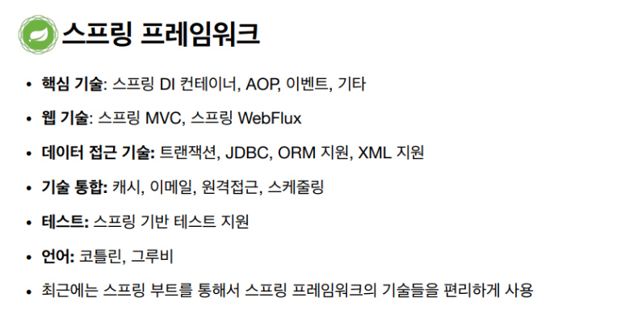
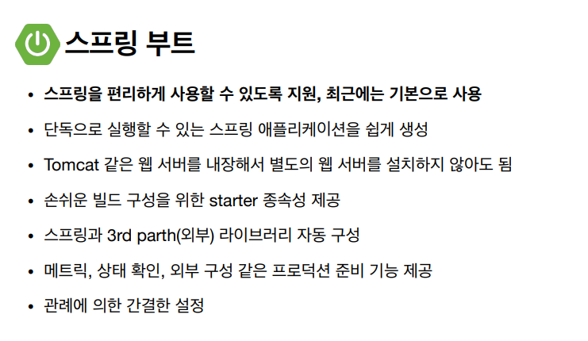
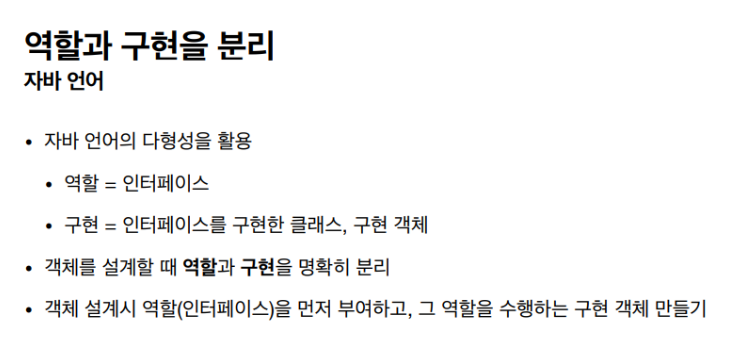
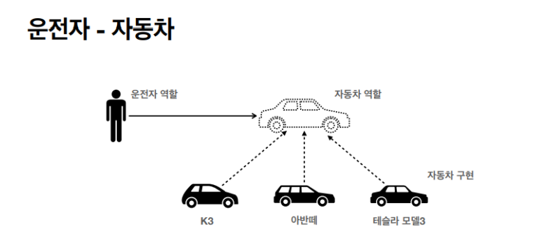
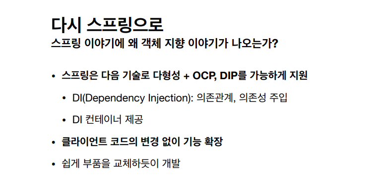
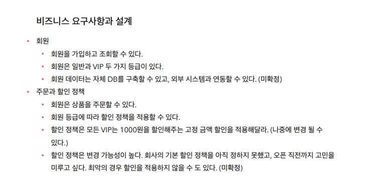
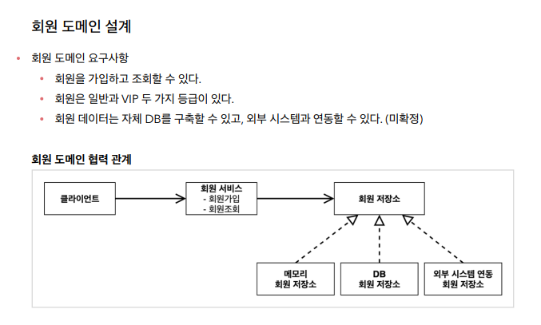
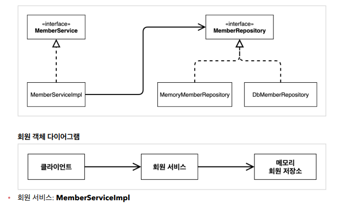

# 내용 정리

# 🖥️ 스프링이란?

스프링 프레임워크는 내부적인 모든것을 포함하는 거대한 스프링 그 자체이다. 그리고 스프링 부트같은경우는 그런 프레임워크의 날개라고 생각할수있다. 기존에 세팅하기 힘들었던 데이터베이스 (톰캣) 외부 라이브러리 구성 등등을 손쉽게 처리해주기 위해 존재하는게 스프링 부트이다.

객체 지향 프로그래밍(Object Oriented Programming)에서 중요하게 생각해야 하는 것은 **다형성(Polymorphism)**인데 스승님의 강의에서는 이것을 **역할(Interface)** 와 **구현(Implementation)**으로 구분하였다.

자동차 역할(Implementaion)을 Interface, 이것을 상속 받는 실제 자동차를 구현(Implementation)으로 설명
- 오버라이딩 : 한 클래스가 같은 인터페이스를 상속하면서도 그 내부에 기능을 유연하게 변경할 수 있는 것

# 💎 스프링 과 객체 지향 
- 다형성이 가장 중요하다
- 스프링은 다형성을 극대화해서 이용할 수 있게 도와준다
- 스프링에서 이야기하는 제어의 역전, 의존관계 주입은 다형성을 활용해서 역할과 구현을 편리하게 다를 수 있도록 지원한다.
- 스프링을 사용하면 마치 레고 블력 조립하듯이 공연 무대의 배우를 선택하듯이 구현을 편리하게 할 수 있다.

## 🔍 좋은 객체 지향 설계의 5가지 원칙의 적용

### 1. SRP 단일 책임 원칙(single responsibility principle)
**한 클래스는 하나의 책임만 거져야 한다.**
- SRP 단일 책임 원칙을 따르면서 관심사를 분리
- 구현 객체를 생성하고 연결하는 책임은 AppConfig가 담당
- 클라이언트 객체는 실행하는 책임만 담당

### 2. DIP 의존관계 역전 원치(dependency inversion principle)
**프로그래머는 "추상화에 의존해야지, 구체화에 의존하면 안된다." 의존성 주입은 이 원칙을 따르는 방법 중 하나다.**

### 3. OCP 의존관계 역전 원칙(open/closed principle)
**소프트웨어 요소는 확장에는 열러 있으나 변경에는 닫혀 있어야 한다.**
- 다형성 활용

### 4. LSP 리스코프 치환 원칙(Liskov substitution principle)
**프로그램 객체는 프로그램의 정확성을 깨뜨리지 않으면서 하위 타입의 인스턴스로 바꿀 수 있어야 한다.**

### 5. ISP 인터페이스 분리 원칙(Interface segregtaion principle)
**특정 클라이언트를 위한 인터페이스 여러 개가 범용 인터페이스 하나보다 낫다.**

# 💎 스프링 핵심 원리 이해 1편
순수한 자바 코드로만 이용해가지고 역활과 구현을 나누고 실제 요구상황이 나올때 얼마나 자연스럽게 바꿀수 있는지를 확인하기 위해 시작하는 예제이다.

## 회원 도메인 설계

## 희원 클래스 설계

## 주문과 할인 도메인 설계

## 주문 도메인 협력, 역할, 책임

# 💎 스프링 핵심 원리 이해 2편

## 새로운 할인 정책 개발

## 새로운 할인 정책 적용과 문제점

- 강의에서는 기존에 OrderService 인터페이스를 상속받은 OrderServiceImple 이라는 구현체를 사용 
- 그리고 이 구현체 안에서 할인 정책을 선택했는데 새로운 정책이 나타남에 따라서 위에 코드처럼 RateDiscountPolicy 로 구현체를 지정해주었다.

**그러나**

이런 방법은 문제가 많다. 왜냐면 이 전에 배웠던 SOLID 방식에서 **두가지나 위반**하고 있기를 때문이다.

가장 먼저 **DIP** 를 위반하고 있다, 왜 냐면은 클래스 의존관계를 봤을때 지금 클래스는 인터페이스 뿐만 아니라 구현체에도 의존하고 있기때문이다. 한마디로, DiscountPolicy 인터페이스에만 의존해야하지만 지금은 FixDiscountPolicy 와 RateDiscountPolicy 둘 다 의존하고있다.

두번째로 **OCP** 를 위반하고 있다. 지금 처럼 할인 정책을 바꾸는 확장 기능에서 클라이언트 코드에 영향을 주고 있다. 예를 들어, 직접 OrderServiceImple 에 들어가서 Policy 를 직접 바꿔주고 있다.

### 해결 방법
오로지 클래스가 인터페이스에만 의존할수있도록 변경!!

## 관심사의 분리
모든 강의를 통틀어서 이 부분에서 가장 긴 강좌시간이 나왔었고 알려주는 강사님 조차 너무나도 중요한 부분이라고 강조를 했었다.

애플리케이션의 관심사를 분리하는 부분에 대해서 설명을 해줄때 강조 했던 하나는 구현체가 절대로 다른 구현체를 선택하는 일은 없어야 하고 어떤 구현체를 선택할지는 별도의 클라이언트가 정하는것 이라고 했다.

그 예를 들어 역활극이라는 예를 들어서 절대로 배우가 다른 배우를 선택하는 책임을 가져서는 안되고 배우는 자신의 역활 (인터페이스) 에만 집중을 하고 그에 맞는 배우를 선택하는것은 공연 기획자라고 하였다. 꽤 적절한 비유같았다.

# 💎 AppConfig 
- 애플리케이션의 전체 동작 방식을 구성하기 위해, 구현 객체를 생성 하고, 연결 하는 책임을 가진 별도의 클래스라고 한다.

1. 인터페이스의 이름으로 된 public method를 생성 
2. return 부분에서 객체를 만들어 준 후에 parameter 안에다가 원하는 구현체를 삽입
3. 레퍼런스를 생성자를 통해서 주입 해준다.

그 결과, 실제로 MemberServiceImpl 은 인터페이스에만 의존중이고 그 어떤 구현체에도 의존하고 있지않다. 그리고 처음에 MemberServiceImpl(MemberRepository memberRepository) 를 부른 순간 AppConfig 에서 레퍼런스를 직접 만들어줘서 똑같은 기능을 수행할수있지만 의존관계가 완전히 형성이 됐다.

여기서 핵심중 하나인 DI의 정의가 나오는데 **의존관계 주입 또는 의존성 주입**이라고 한다. 왜냐면은 appConfig 객체가 대신 리포지토리를 생성해주고 그 참조값을 생성자로 전달해주고 있기때문이다.

### AppConfig 실행

### 새로운 구조와 할인 정책 적용

Appconfig 를 쓰면서 가장 많이 달라진점이라고 생각한다. 사용영역하고 구성의 영역이 명확히 달라졌다. 구성을 하는 역활을 AppConfig 가 담당함으로서 사용영역은 그 역활만 수행하면 되게 바뀌었다.

할인 정책을 바꾸고 싶다면 정말 간단하게 return 값만 바꿔주면 된다. 가장 큰 이점은 우리가 전처럼 직접적으로 OrderServiceImpl 을 포함해 사용역역의 코드를 안바꿔도 되고 공연의 기획자로 AppConfig 를 생각하면 편하다.

# 💎 스프링 컨테이너
- ApplicationContext 를 스프링 컨테이너라 한다
- 기존에는 개발자가 AppConfig 를 조작하여 직접 객체를 생성하고 DI를 했지만, 이제부터 스프링 컨테이너를 통해서 사용한다.

## 스프링 컨테이너와 스프링 빈

### 스프링 컨테이너 생성 과정

1번 과정, 스프링 컨테이너 안에 AppConfig 의 정보를 넣는순간 컨테이너가 생성이 된다. 컨테이너는 구성 정보를 AppConfig 로 부터 받는다.

- 스프링 컨테이너안에 있는 객체들은 서로의 클래스에 의존하는 관계를 유지하고 있고 컨테이너는 이러한 관계를 주입 시켜준다.

# 💎 싱글톤 컨테이너

## 웹 애플리케이션과 싱글톤 

웹 애플리케이션은 기본적으로 많은 고객이 동시에 요청을 한다. 그러나 지금 유지하고 있는 코드처럼 요청이 들어올때마다 객채를 새로 만들게 되면 메모리 낭비가 너무 심하므로, 1개를 생성하고 공유하도록 설계 해야하는데 이것을 **싱글톤 패턴** 이라고 부른다.

### 싱글톤 컨테이너

- 객체 인스턴스를 1개만 생성 (싱글톤) 해서 관리하는 방법이 지금껏 스프링 빈으로 우리가 사용하던 기술이었다.
- 스프링 컨테이너가 이렇게 싱글톤 객체를 생성하고 관리하는기능을 싱글톤 레지스트리라고 한다.

- @Bean 이 붙은 method 를 불러도 이미 의존관계가 DI 된 상태면은 객체 하나로 모두 한번만 호출이 된다.

- AppConfig 에는 @Configuration 이 붙어있는데 @Bean 을 대신해서 쓰면은 싱글톤이 유지가 안된다. 간단히 설명하면 상위 클래스에 의해서 AppConfig 또한 싱글톤이 유지된다고 했다. **설정 정보는 항상 @Configuration** 을 사용하자

### 컴포넌트 스캔

#### 컴포넌트 스캔과 의존관계 자동 주입

- 코드로 컴포넌트 스캔을 통해서 의존관계 자동 주입을 할수있다.

- 컴포넌트 스캔은 이름 그대로 @Component 애노테이션을 클래스에 붙히면 된다. 그렇다면 애노테이션이 붙은 클래스 스캔 후 빈으로 등록한다. (@Configuration 에는 @Component 에노테이션이 자동으로 붙어있다)

- 유심하게 볼 점들은 클래스에 @Component 가 붙어있고 @Bean을 통해 직접 설정 정보를 작성한거에 비해서 이제는 의존관계 주입도 클래스 안에서 해결해야한다.

- @Autowired 는 의존관계를 자동으로 주입해준다.

- @Autowired 사용 예시

- 컴포넌트 스캔 과정이다. @Bean 을 썼던거와 굉장히 유사하고 비슷한 원리로 컨테이너는 @Component 가 붙은 모든 클래스를 스프링 빈으로 등록한다.

- @AutoWired 에 대한 설명이 조금 이해안된다 생각했는데 DI를 위한 과정이라고 생각하고 있고 @AutoWired를 써주는 순간 컨테이너에서 해당 타입에 맞는 빈을 찾은후 주입해준다고 한다.
- 파라미터가 많아도 동시에 자동으로 주입해준다.

### 탐색 위치와 기본 스캔 대상
- 컴포넌트 스캔을 자바 클래스 전부를 포함해서 진행한다면 시간이 오래 걸리므로 이렇게 위치 지정을 하는것도 좋은 방법이라 한다.

## 의존관계 자동 주입

### 다양한 의존관계 주입 방법

의존관계 주입에는 다양한 방법이 존재하고 있다한다. 가장 대표적인 주입방법으로는,

1. 생성자 주입
2. 수정자 주입 (setter 주입)
3. 필드주입

하지만 강의에 내용 끝에서는 요약본으로 생성사 주입이 가장 많이 선택된다고 했고 권장한다고 하였다.

생성자 주입이 권장되는 이유중 하나는 순수한 자바 언어의 특징을 잘 살리는 강점이 있기때문이라기도 했다.